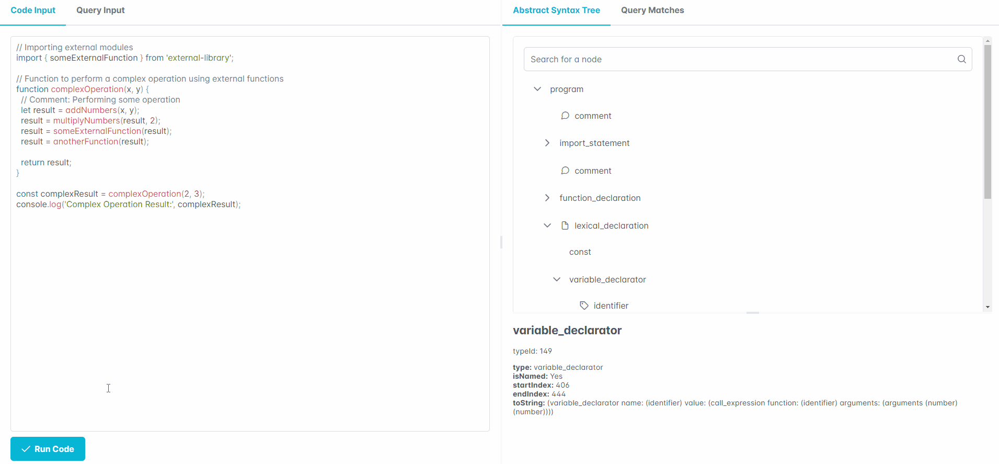

# Tree Sitter Visualizer 🌳

Welcome to the Tree Sitter Visualizer! 🚀 This tool lets you explore and understand your JavaScript code effortlessly. Analyze the Abstract Syntax Tree (AST), run custom queries, and visualize the results with an interactive tree component.

## Why Use Tree Sitter Visualizer? 🤔

Practicing Tree Sitter queries has never been easier.

- **Real-time Visualization:** Explore the AST and query results with a dynamic tree component.
- **Effortless Querying:** Run custom queries to find specific patterns in your code. The interactive tree visualization makes it easy to explore the results.

- **No More toString() Mess:** Forget about deciphering those cumbersome `toString()` representations. With Tree Sitter Visualizer, you can directly interact with the tree nodes, gaining a clearer understanding of your code's structure.

- **Contextual Code Views:** The context menu lets you view code snippets for any tree node.

- **Split View:** View both your code and the tree component side by side.

- **Code Editor with Syntax Highlighting:** Edit your code with a syntax-highlighted editor.

## Getting Started 🚀

1. Clone this repository: `git clone https://github.com/cpdally/tree-sitter-visualizer.git`
2. Install dependencies: `npm install`
3. Start the React app: `npm start`
4. Starting the API 🛠️: Navigate to the `api` directory and start the API server with `node .\treeAPI.js`
5. Make sure the API server is running before using the React app.

## Usage 📚

### Code Input 📝

- **Code Input Tab:** Enter your JavaScript code in the provided code editor.
- **Run Code Button:** Click the "Run Code" button to parse and visualize the AST.

###

### Query Input 📜

- **Query Input Tab:** Enter your Tree Sitter Query in the provided Query editor.
- **Run Query Button:** Click the "Run Query" button to parse and visualize the AST(s).

###

### How the Tree Works 🌲

The tree component follows the exact structure of the tree-sitter tree, it is not a "pruned" abstraction. This means that all node relations map directly:

- **Interactive Tree:** Click on nodes to view detailed information.
- **Context Menu:** Right-click on nodes to view the context menu and click "View Code" to see the source code.
- **Search:** Use the search bar to filter nodes based on your criteria.

###

## Alerts 📬

- When you hit the "Run Code" or "Run Query" button, check the notification for the status of your query or code parsing.
- Receive notifications for API or query errors.

###

## Tips 🚦

- The code doesn't need to be valid; Tree Sitter will identify errors and highlight the problematic part of the tree.
- Use Splitters to resize different parts of the screen.
- Try copying the `toString()` field of the node information tab to get started with a query.

###

## References 🛠️

Huge thanks to all my dependencies:

- **PrimeReact:** A collection of rich UI components for React.
  - [PrimeReact Documentation](https://primefaces.org/primereact/showcase/#/)

- **Tree-Sitter:** A parser generator tool and an incremental parsing library.
  - [Tree-Sitter GitHub Repository](https://github.com/tree-sitter/tree-sitter)

- **Prism:** A lightweight, extensible syntax highlighter.
  - [Prism GitHub Repository](https://github.com/PrismJS/prism)

- **Express:** A fast, unopinionated, minimalist web framework for Node.js.
  - [Express.js Documentation](https://expressjs.com/)

- **tree-sitter-javascript:** The JavaScript grammar for Tree-Sitter.
  - [tree-sitter-javascript GitHub Repository](https://github.com/tree-sitter/tree-sitter-javascript)

## Known Issues 🐛

1. **Code Input Display Glitch on Large Inputs:**
   - **Issue:** Text may appear doubled in the code input field for extensive code.
   - **Workaround:** Break down large code inputs to mitigate display problems.
2. **Node Expansion Status Not Retained Between Tabs:**
   - **Issue:** The selected node's expansion status is not retained when switching between AST and Query Matches tabs.
   - **Workaround:** Manual re-expansion of nodes is required after switching tabs to maintain the selected node's visibility.

3. **Node Selection Not Retained Between Tabs:**
   - **Issue:** The selected node is not retained when navigating between AST and Query Matches tabs.
   - **Workaround:** Re-select the node in the desired tab to view its details.

Feel free to explore and enhance this Tree Sitter Visualizer! Happy queries! 🚀🌈✨
